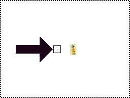
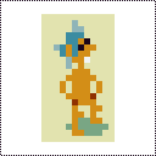
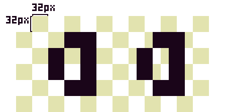

# 20210124 Game Design Document

This is the start of a game design document I had been working on in 2020 and
wanted to preserve somewhere despite it being so incomplete.

# <br>Game Design Document

<!-- @import "[TOC]" {cmd="toc" depthFrom=2 depthTo=6 orderedList=false} -->
<!-- code_chunk_output -->

- [Design](#design)
  - [Hard Pixels](#hard-pixels)
  - [mem Font](#mem-font)
- [Gameplay](#gameplay)
  - [Action](#action)
  - [Items and Collecting](#items-and-collecting)
    - [Health](#health)
      - [Apple](#apple)
      - [Preserved Bananas](#preserved-bananas)
    - [Weapons](#weapons)
      - [Hyper Space Dagger](#hyper-space-dagger)
    - [Ammo](#ammo)
      - [Stingers (Bee Stingers)](#stingers-bee-stingers)
    - [Widgets (Modifiers)](#widgets-modifiers)
      - [Timeless Rose](#timeless-rose)
  - [Inventory Management](#inventory-management)
  - [RPG](#rpg)
    - [Experience Points (XP), Progression](#experience-points-xp-progression)
  - [Influences](#influences)
- [The Worlds of Nature Elsewhere](#the-worlds-of-nature-elsewhere)
  - [Plot](#plot)
  - [Levels and Level Flow](#levels-and-level-flow)
    - [Menus](#menus)
      - [Title](#title)
      - [Options](#options)
      - [Level Select](#level-select)
      - [In-Game Level Editor](#in-game-level-editor)
      - [Map, Inventory, and Status](#map-inventory-and-status)
      - [Game Over / Continue Loop](#game-over-continue-loop)
      - [End / Win](#end-win)
    - [Stages](#stages)
      - [Earth](#earth)
        - [Field](#field)
        - [Ruined Library](#ruined-library)
        - [Lost College](#lost-college)
        - [Storymaker](#storymaker)
      - [Moon](#moon)
        - [Abandoned Moonbase](#abandoned-moonbase)
        - [The Immortal Vessel](#the-immortal-vessel)
  - [Inhabitants](#inhabitants)
    - [Player](#player)
    - [Nature](#nature)
      - [Bee](#bee)
- [Development](#development)
  - [Fractional to Integral Conversions, Rounding Errors, Jittering, and Working with Pixels](#fractional-to-integral-conversions-rounding-errors-jittering-and-working-with-pixels)
    - [Update Order](#update-order)
    - [Truncation, Rounding, Flooring, and Ceiling](#truncation-rounding-flooring-and-ceiling)
    - [Shader Floating Point Limits](#shader-floating-point-limits)
    - [Floating Point Modulo](#floating-point-modulo)
  - [Scaling](#scaling)
- [Level Format and Parsing](#level-format-and-parsing)
- [License](#license)
  - [GPL-3.0-only](#gpl-30-only)
  - [CC-BY-SA-4.0](#cc-by-sa-40)

<!-- /code_chunk_output -->

## Design

### Hard Pixels

 <br>
_Above left: pixels are small on high resolution displays. A single native pixel is centered within the box pointed at by the arrow. The lines of the box are also one pixel thick. Next to the box is an unscaled native render of a sprite. Above right: the same sprite rendered with scaling. Scaled pixels are integral multiples of native pixels. For example, 1x, 2x, 3x, and 4x scaled pixels are 1 px x 1 px (1 px<sup>2</sup>), 2 px x 2 px (4 px<sup>2</sup>), 3 px x 3 px (9 px<sup>2</sup>), and 4 px x 4 px (16 px<sup>2</sup>), respectively. The native size of this sprite with its background is 12 px x 21 px for a total of 252 native pixels. In this 10x render, every single scaled pixel is 100 native pixels for a total of 25 200 native pixels._

Pixel graphics are prevalent among early video games as well as modern indies. The term is broad and applicable but Nature Elsewhere can be further defined as a "hard pixels" game wherein:

- Low resolution renders are scaled to better fit a diversity of displays. Rendered pixels are therefore called "scaled pixels" as opposed to conventional unscaled native or physical device pixels. See [scaling](#scaling).
- All rendered content aligns to the scaled pixels grid. Scaled pixels are atomic. That is, the smallest units visible, and are completely set or unset. Fractions are used for many intermediate calculations but integral truncation concludes all visible results so as to align. This includes camera positioning. See [rounding](#truncation-rounding-flooring-and-ceiling).
- Per sprite scaling is used sparingly and is independent of scaled pixel grid alignment. Universal per sprite scaling is _never_ used to effect pseudo sub-scaled pixel movement.
- All scaling is integral, aliased, and often uniform.
- Transparency is used often. Antialiasing, blurring, and translucency are never used for sprites, OpenGL shader-based effects, or any other rendering.
- All colors are derived from a minimal palette.

The aspirations of hard pixels are:

- To be as pixel perfect as practical. A balance between modern affordances and rigid adherence to more traditional pixel art.
- To give the illusion that the display's native pixels match the render scale. There are no intermediate states. Pixel art is unique in that pixels are digital, on or off, and nowhere in between. There's no blurriness unlike our analog reality. This limited state is a profound and wonderful property that Nature Elsewhere attempts to preserve as much as possible for all visual matters.
- A feeling of total clarity and finitude. Many permutations are possible but there's no ambiguity. The world of Nature Elsewhere is lockstep, synchronous, and completely coherent and cohesive.
- A feeling that repeat identical inputs produce deterministic outputs.

Many modern pixel games use scaled sprites in high resolution unscaled renders. In isolation, these sprites are conventional pixel art. However, they align to the device's _native_ pixel grid and may be antialiased. This works well for many games but Nature Elsewhere retains the consistency of a scaled pixel grid for all rendered content.



_Above: a 32x scaled render. The checkerboard pattern shows the scaled pixel grid. Each checkerboard square represents a \_single_ scaled pixel that occupies 1024 native pixels. Since a scaled pixel is logically a single cohesive whole pixel that is on or off, only completely filling or not filling any square is valid.\_

_On the left, "a" is aligned to the scaled pixel grid giving the illusion of real albeit large pixels. On the right, "a" is misaligned to the native pixel grid along the horizontal axis, breaking the illusion of pixelation when any other differently aligned content is considered in relation. In a hard pixels game like Nature Elsewhere, only the former is used and "a" would only move in multiples of 32 native pixels in either direction._

Hard pixels feels distinctive. Trends towards high resolution anti-aliased graphics in both popular and pixel art games, display motion blur, and cathode-ray tube television scan lines and distortion, give the experience a distinct "hard" or "toothy" feeling like ratcheting something into position with a coarse geared machine. The feeling is particularly pronounced on the camera movement which hops in scaled pixel increments. This snapping feels quite toothy.

camera scaling is incorrect for last pixel row and column

### mem Font


**[mem](https://rndmem.com)** has grown from the most minimalist, monospaced, barely
legible font to a five pixels wide by six pixels tall (plus one pixel leading),
balanced, proportional, sans light font designed for maximal readability. Readability is improved by both consistency and favoring smoother forms that avoid diagonal pixels and usually come at the expense of a little personality and sometimes a more optimal form in isolation but better overall consistency with the set. Each character is as wide as it should be and as small as it can be. Further details on the design of mem can be read in the [project repo](https://github.com/oddoid/mem).

mem is now available as a sprite sheet and a TrueType Font. Nature Elsewhere consumes the former.

Only the renderer and shaders are aware of scaled pixels. All other code assumes a one-to-one point to pixel mapping.

## Gameplay

Isometric action RPG.

### Action

### Items and Collecting

There are many drops available in the game. Most are useless.

#### Health

##### Apple

##### Preserved Bananas

#### Weapons

##### Hyper Space Dagger

#### Ammo

##### Stingers (Bee Stingers)

#### Widgets (Modifiers)

##### Timeless Rose

### Inventory Management

### RPG

#### Experience Points (XP), Progression

### Influences

## The Worlds of Nature Elsewhere

### Plot

### Levels and Level Flow

#### Menus

##### Title

##### Options

##### Level Select

Unlockable

##### In-Game Level Editor

Unlockable. Files are saved as "cartridges" JSON blobs. See save file format in-source documentation. Files are shareable and there's nothing special or unique about them.

##### Map, Inventory, and Status

##### Game Over / Continue Loop

##### End / Win

#### Stages

##### Earth

###### Field

###### Ruined Library

###### Lost College

###### Storymaker

##### Moon

###### Abandoned Moonbase

###### The Immortal Vessel

### Inhabitants

#### Player

#### Nature

##### Bee

## Development

### Fractional to Integral Conversions, Rounding Errors, Jittering, and Working with Pixels

#### Update Order

All integral variables passed from JavaScript to WebGL are inherently truncated.
When passing an independent variable, this implicit truncation by converting to
shader input is acceptable. However, when deriving a renderable variable from
another variable, the first must be truncated independently to avoid possible
jitter. That is, inconsistent results.

For example, consider deriving camera position at an offset from the player's position.
The player may be at 0.1 and the camera follows at an offset of 100.9. The
rendered player's position is implicitly truncated to 0. Depending on
formulation, the rendered camera's position may be (inconsistencies in bold):

| Formula Type                  | Formula                  | Result   | Rendered player | Rendered camera | Rendered distance |
| ----------------------------- | ------------------------ | -------- | --------------- | --------------- | ----------------- |
| Implicit truncation.          | 0.1 px + 100.9 px        | 101.0 px | 0 px            | 101 px          | **101 px**        |
| Truncate before player input. | trunc(0.1 px) + 100.9 px | 100.9 px | 0 px            | 100 px          | 100 px            |
| Truncate after player input.  | trunc(0.1 px + 100.9 px) | 101.0 px | 0 px            | 101 px          | **101 px**        |

Now when the player's position has increased to 1.0 and the rendered position is
1 px, one pixel forward. The rendered distance between the camera and the player
should be constant and not change regardless of where the player is.

| Formula Type                  | Formula                  | Result   | Rendered player | Rendered camera | Rendered distance |
| ----------------------------- | ------------------------ | -------- | --------------- | --------------- | ----------------- |
| Implicit truncation.          | 1.0 px + 100.9 px        | 101.9 px | 1 px            | 101 px          | **100 px**        |
| Truncate before player input. | trunc(1.0 px) + 100.9 px | 101.9 px | 1 px            | 101 px          | 100 px            |
| Truncate after player input.  | trunc(1.0 px + 100.9 px) | 101.0 px | 1 px            | 101 px          | **100 px**        |

As shown above, when truncation is not performed or it occurs afterwards on the
sum, rounding errors can cause the rendered distance between the camera and the
position to vary under different inputs instead of remaining at a constant
offset from the player. This causes a jarring jitter effect.

#### Truncation, Rounding, Flooring, and Ceiling

Because truncation is always implied, any intermediate truncation is strongly
preferred to rounding, flooring, or ceiling. Consider when the player is at 0.1
px, 0.5 px, 1.0 px, and -0.5 px:

| Formula (player at 0.1 px) | Result   | Rendered player | Rendered camera | Rendered distance |
| -------------------------- | -------- | --------------- | --------------- | ----------------- |
| trunc(0.1 px) + 100.9 px   | 100.9 px | 0 px            | 100 px          | 100 px            |
| round(0.1 px) + 100.9 px   | 100.9 px | 0 px            | 100 px          | **100 px**        |
| floor(0.1 px) + 100.9 px   | 100.9 px | 0 px            | 100 px          | **100 px**        |
| ceil(0.1 px) + 100.9 px    | 101.9 px | 0 px            | 101 px          | **101 px**        |

| Formula (player at 0.5 px) | Result   | Rendered player | Rendered camera | Rendered distance |
| -------------------------- | -------- | --------------- | --------------- | ----------------- |
| trunc(0.5 px) + 100.9 px   | 100.9 px | 0 px            | 100 px          | 100 px            |
| round(0.5 px) + 100.9 px   | 101.9 px | 0 px            | 101 px          | **101 px**        |
| floor(0.5 px) + 100.9 px   | 100.9 px | 0 px            | 100 px          | **100 px**        |
| ceil(0.5 px) + 100.9 px    | 101.9 px | 0 px            | 101 px          | **101 px**        |

| Formula (player at 1.0 px) | Result   | Rendered player | Rendered camera | Rendered distance |
| -------------------------- | -------- | --------------- | --------------- | ----------------- |
| trunc(1.0 px) + 100.9 px   | 101.9 px | 1 px            | 101 px          | 100 px            |
| round(1.0 px) + 100.9 px   | 101.9 px | 1 px            | 101 px          | **100 px**        |
| floor(1.0 px) + 100.9 px   | 101.9 px | 1 px            | 101 px          | **100 px**        |
| ceil(1.0 px) + 100.9 px    | 101.9 px | 1 px            | 101 px          | **100 px**        |

| Formula (player at -0.5 px) | Result   | Rendered player | Rendered camera | Rendered distance |
| --------------------------- | -------- | --------------- | --------------- | ----------------- |
| trunc(-0.5 px) + 100.9 px   | 100.9 px | 0 px            | 100 px          | 100 px            |
| round(-0.5 px) + 100.9 px   | 100.9 px | 0 px            | 100 px          | **100 px**        |
| floor(-0.5 px) + 100.9 px   | 99.9 px  | 0 px            | 99 px           | **99 px**         |
| ceil(-0.5 px) + 100.9 px    | 100.9 px | 0 px            | 100 px          | **100 px**        |

It's also possible to see intense jittering when moving diagonally. For example, moving
an image left one pixel on one frame and then up another pixel on the next
frame. It is often better to instead synchronize the movements in each direction
to occur on the same frame.

Fractional numbers are unfriendly to pixel art. A recurring problem in the
project has been weird pixel glitches and these have often been rooted in
rounding errors. Since JavaScript only supports BigInt and typed arrays
natively, the [XY] and [WH] TypeScript classes helped encapsulate some of the
truncation inherent when working with strictly integers. They surprisingly
worked extraordinarily well but Rust has support for many integral types.

[xy]: https://github.com/oddoid/nature-elsewhere/blob/typescript/src/math/XY.ts
[wh]: https://github.com/oddoid/nature-elsewhere/blob/typescript/src/math/WH.ts

#### Shader Floating Point Limits

My Pixel XL phone's [`mediump` precision is noticeably
lower](https://stackoverflow.com/a/4430934/970346) than my laptop's. Since the
program's execution time is fed into the shader as a floating point, this was
quickly overflowing causing calculations to become quite out of sync. I've
since increased the request to `highp`.

#### Floating Point Modulo

Floating point errors can occur when taking relatively small divisors of very
large numbers. [The following] seemed to work ok and is [the definition for
OpenGL's `mod`](https://www.khronos.org/registry/OpenGL-Refpages/gl4/html/mod.xhtml):

```
// 0x4000 is 2^14 (mediump).
val = val - Math.trunc(val / 0x4000) \* 0x4000
```

[the following]: https://wikipedia.org/wiki/Modulo_operation#Remainder_calculation_for_the_modulo_operation

### Scaling

Integer scaling with a minimum size seems to work best.

- Maximum integer scaling to the minimum dimension (width or height) can leave
  large empty areas. For example, these might be rendered as vacant black bars
  on the left and right.
- Noninteger scaling produces odd pixels that are inconsistently sized. This is
  especially noticeable for such large, low-resolution virtual pixels. Either
  they're slightly larger than their neighbors, missing, or rendered incorrectly
  (e.g., black or glitchy) due to integer assumptions elsewhere.
- Given an ideal viewport size, integer scaling usually generates an image
  that's either too large or too small. Picking the maximum integer scale that
  shows a minimum viewport size works well. The result is either a
  viewport that is scaled exactly to the document size or the next size larger.
  In the (frequent) latter case, the result is simply to show larger viewport
  than ideal. If different minimum viewport sizes are used, the scaling may
  vary which means that pixels will vary in size between levels. This is a
  compromise but seems to work visually. Even with integral scaling, both
  dimensions (which are likely disproportionate) must be considered and rounding
  up must be performed. Otherwise, strange and often subtle visual artifacts
  will creep in.

The scaling transformation can be done in a number of ways. The best approach
may be to change the canvas and viewport size to match the document every frame,
and then do all the scaling in WebGL. This keeps all the math as a projection
in WebGL which keeps things much simpler than diving into the world of CSS. Note
also that the width and height Canvas attributes are changed, not the style
width and height properties. The latter is a scaling operation.

Listening for window size events asynchronously seems to be a common pitfall as
well, which I stumbled into while working with Phaser 2.

There are many configurations that mostly work but I only found a couple that
worked well. This was all quite a frustration when combined with synchronizing
all the different Phaser 2 framework subsystems and eventually led me to pursue
WebGL.

## Level Format and Parsing

## License

© Stephen Niedzielski.

### GPL-3.0-only

This program is free software: you can redistribute it and/or modify it under
the terms of the GNU General Public License as published by the Free Software
Foundation, version 3.

This program is distributed in the hope that it will be useful, but WITHOUT ANY
WARRANTY; without even the implied warranty of MERCHANTABILITY or FITNESS FOR A
PARTICULAR PURPOSE. See the GNU General Public License for more details.

You should have received a copy of the GNU General Public License along with
this program. If not, see <https://www.gnu.org/licenses/>.

### CC-BY-SA-4.0

This work, excluding source code, is licensed under the Creative Commons
Attribution-ShareAlike 4.0 International License. To view a copy of this
license, visit https://creativecommons.org/licenses/by-sa/4.0/ or send a letter
to Creative Commons, PO Box 1866, Mountain View, CA 94042, USA.

```
╭>°╮┌─╮┌─╮╭─╮┬┌─╮
│  ││ ││ ││ │││ │
╰──╯└─╯└─╯╰─╯┴└─╯
```
